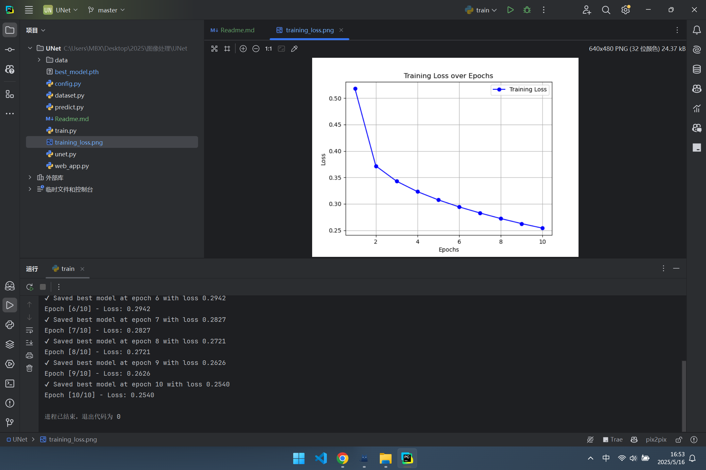
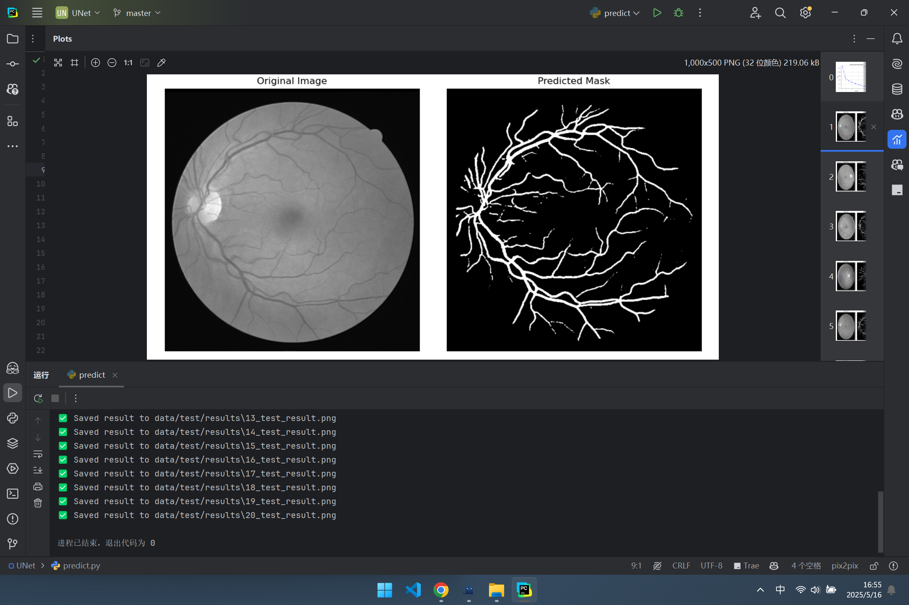
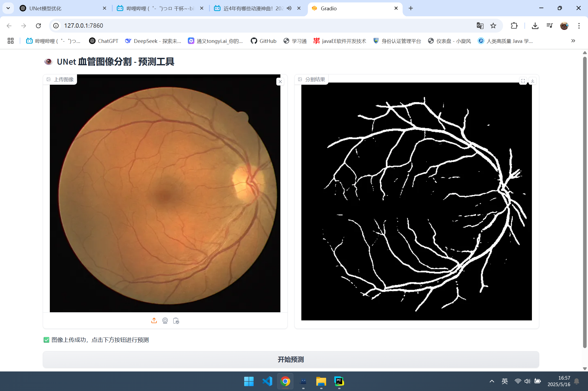
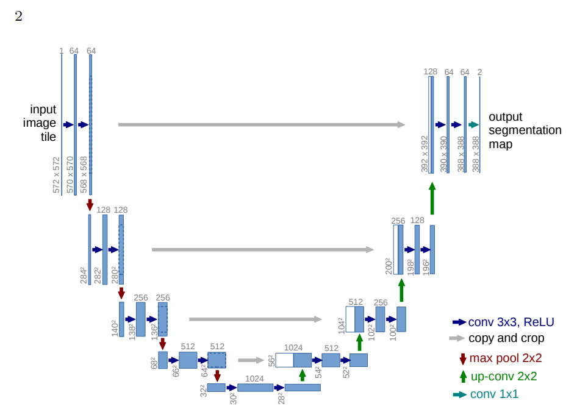

# UNet 血管图像分割项目🩸

## 📌 项目概述

本项目为广东药科大学 2025 年医学图像处理课程的大作业，基于 UNet 网络实现血管图像分割任务，采用 PyTorch 构建模型。

通过训练 UNet 模型，能够对输入的血管图像进行分割，生成对应的二值化分割结果。同时提供一个基于 Gradio 的 Web
应用，便于用户上传图像并进行实时预测。

## 🎬 项目演示

🔧 训练过程  


🎯 预测结果  


🖥️ Web 应用  


> 注：以上预测结果为模型训练 10 轮后的效果，由于硬件设备和时间限制，效果有所不足，后续将持续训练以提升模型性能。

---

## 🛠️ 环境搭建

### 📦 依赖清单说明

| 依赖包             | 用途说明                                       |
|-----------------|--------------------------------------------|
| `torch`         | 深度学习框架，支持模型构建、训练与推理操作                      |
| `torchvision`   | 常用图像处理辅助工具，如预训练模型加载与数据增强                   |
| `numpy`         | 高效的数值计算库，用于图像预处理与矩阵操作                      |
| `opencv-python` | 图像读取、写入与颜色空间转换（如 `cv2.cvtColor`）           |
| `pillow`        | 支持多种图像格式（如 `.tif`、`.png`），Gradio 上传图像也依赖此库 |
| `matplotlib`    | 可视化工具，常用于绘制训练过程中的 loss 曲线、结果展示等            |
| `gradio`        | 构建 Web UI，支持模型的交互式测试与展示界面                  |

### 💽 安装命令

```bash
pip install torch torchvision torchaudio --index-url https://download.pytorch.org/whl/cu118
pip install numpy opencv-python pillow matplotlib gradio
```

### 📁 数据集准备

将 `DRIVE` 眼底血管数据集按下列结构放置在 `data/` 目录下：

```plainText
data/
├── train/
│   ├── images/
│   │   └── *.tif
│   └── 1st_manual/
│       └── *_manual1.gif
└── test/
    └── images/
        └── *.tif
```

---

## 🚀 训练模型

### ⚙️ 配置参数

在 `config.py` 文件中可以修改训练相关参数：

```python
class TrainConfig:
    DATA_PATH = "data/train/"
    EPOCHS = 10
    BATCH_SIZE = 1
    LEARNING_RATE = 1e-5
    # ... 其他参数 ...
```

### 🔧 启动训练

运行 `train.py` 开始训练：

```bash
python train.py
```

> 训练过程会保存最佳模型为 `best_model.pth`，同时产生 `training_loss.png` 用于视化 loss 轮循曲线

---

## 🎯 模型预测

### 💻 命令行预测

在 `config.py` 中配置预测参数：

```python
class PredictConfig:
    MODEL_PATH = "best_model.pth"
    TEST_PATH = "data/test/images/*.tif"
    SAVE_PATH = "data/test/results"
    N_CHANNELS = 1
    N_CLASSES = 1
```

运行 `predict.py` 进行预测：

```bash
python predict.py
```

> 预测结果会保存在指定文件夹，同时在窗口显示分割效果

### 🌐 Web 应用

使用 Gradio 构建交互式 UI：

```bash
python web_app.py
```

> 打开浏览器访问 [http://localhost:7860](http://localhost:7860) 即可进行分割测试

---

## 📂 项目结构

```plaintext
.
├── README.md         # 项目说明文件
├── best_model.pth
├── config.py         # 配置文件
├── data/             # 数据集目录
│   ├── test/
│   └── train/
├── dataset.py        # 数据加载与预处理
├── predict.py        # 预测脚本
├── train.py          # 训练脚本
├── unet.py           # UNet 模型
└── web_app.py        # Gradio Web 应用
```

---

## ⚠️ 注意事项

* 如果您有 GPU 设备，建议使用 GPU 进行训练，速度显著提升
* 请确保数据格式符合要求，否则可能导致错误

---

## ☝️🤓 训练自己的数据集

1. 实现一个 `Dataset` 类，继承自 `torch.utils.data.Dataset`，并实现 `__len__` 和 `__getitem__` 方法
2. 在 `train.py` 中加载自定义数据集
3. 修改 `config.py` 中的 `DATA_PATH` 和 `N_CLASSES` 参数
4. 运行 `train.py` 进行训练
5. 运行 `predict.py` 进行预测
6. 运行 `web_app.py` 进行 Web 测试
7. 根据需要调整模型参数和训练轮数

---

## 🌟贡献

欢迎任何 Issue 或 Pull Request，你的上传将使项目更加完善！

---

## 📚 参考文献

### 论文

- Ronneberger, O., Fischer, P., & Brox, T. (2015). U-Net: Convolutional Networks for Biomedical Image Segmentation. In
  *Medical Image Computing and Computer-Assisted Intervention – MICCAI 2015* (pp. 234-241). Springer International
  Publishing. [U-Net: Convolutional Networks for Biomedical Image Segmentation](https://arxiv.org/abs/1505.04597)
  

### 代码仓库

- Pytorch-UNet. (n.d.). GitHub repository. Retrieved
  from [https://github.com/milesial/Pytorch-UNet/tree/master](https://github.com/milesial/Pytorch-UNet/tree/master)

---

## 📄 许可证

本项目基于 MIT 协议开源，详见 LICENSE 文件📄
